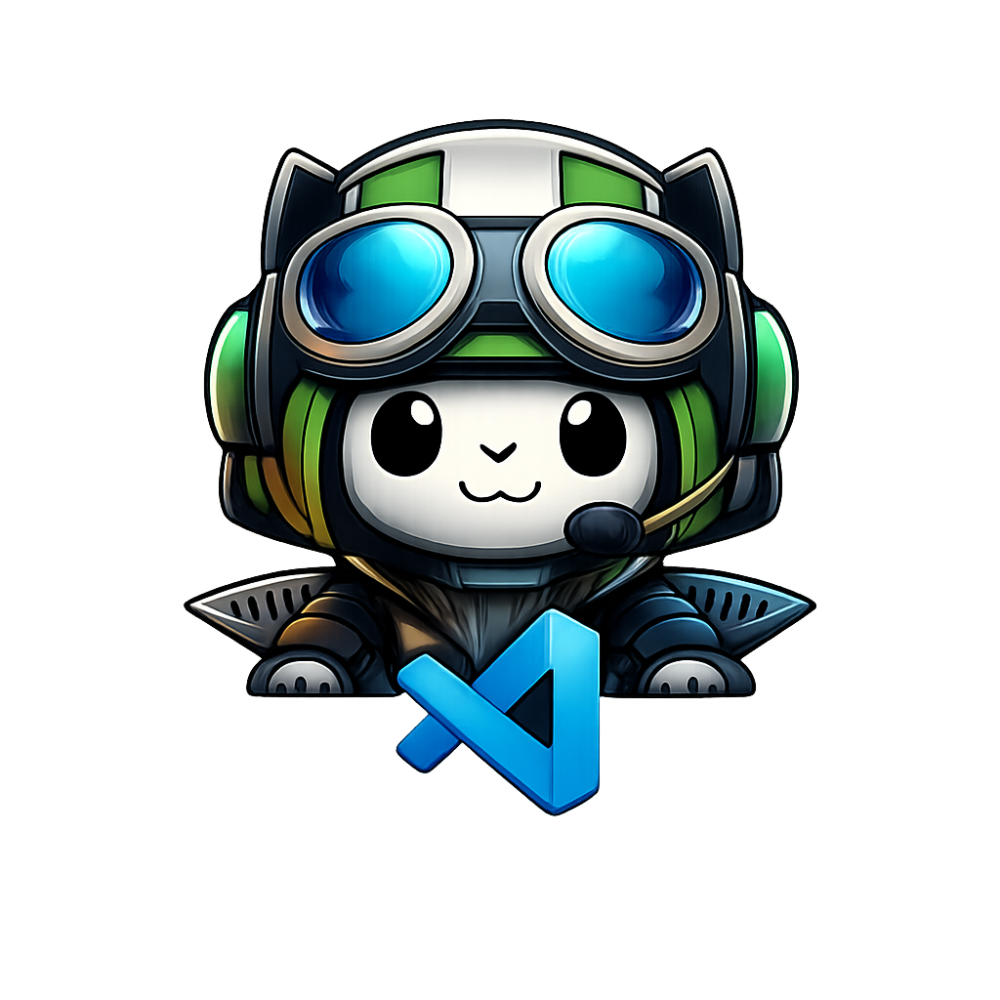

# AnyRAG Pilot

**AI-powered semantic search for VS Code with GPU acceleration**

AnyRAG Pilot brings enterprise-grade Retrieval-Augmented Generation (RAG) to your development workflow. Index your workspace, GitHub repositories, and any content - then search with natural language.

## 🎯 Two Ways to Use

### **@anyrag Chat Participant** - Focused RAG Search
**Use when you want answers ONLY from your indexed content**
- ✅ Guaranteed to search your indexed code/docs only
- ✅ Always shows source attribution with similarity scores
- ✅ No contamination from general LLM knowledge
- 🎯 Perfect for: "How does MY authentication work?" "What's in MY config?"

### **GitHub Copilot + MCP** - Flexible AI Assistant
**Use when you want Copilot's full capabilities with optional RAG**
- ✅ Copilot decides when to use your indexed content
- ✅ Combines your code with general programming knowledge
- ✅ Broad capabilities beyond just code search
- 🌐 Perfect for: General coding help, best practices, mixed context questions

## ✨ Features

- 🎯 **@anyrag Chat Participant** - Targeted search of ONLY your indexed content with source attribution
- 💬 **Chat Indexing** - Index conversations with `/indexchat` (Free: 1 chat, Pro: unlimited)
- 🚀 **GPU Accelerated** - CUDA/MPS support for lightning-fast embeddings
- 🔒 **Privacy First** - All processing happens locally on your machine
- 📚 **Index Anything** - Workspaces, GitHub repos, documentation, chat conversations
- 🔌 **Model Context Protocol** - Integrates with GitHub Copilot as MCP server
- 💾 **Persistent Storage** - Indices survive across sessions

## 💎 Pro Features ($20/month)

- ✨ Unlimited indexed documents (Free: 1000 docs)
- 📦 Unlimited indexed sources (Free: 3 sources)
- 💬 **Unlimited chat indexing** (Free: 1 chat)
- 🎨 **Custom embedding models** - Use any HuggingFace model (Free: 3 presets)
- 🗂️ **Multiple indices** - Organize content by project or use case
- 🏷️ **Chat naming & management** - Rename and organize indexed conversations
- 🎯 Priority support

**[Upgrade to Pro →](https://ragpilot.com/upgrade)**

## 🚀 Quick Start

1. **Install the extension** from VS Code Marketplace
2. **Index your workspace**: `Ctrl+Shift+P` → `AnyRAG Pilot: Index Workspace`
3. **Ask focused questions**: Open chat and use `@anyrag how does authentication work in this codebase?`
   - @anyrag searches ONLY your indexed content and shows sources
   - Regular Copilot chat can use indexed content OR general knowledge
4. **Index conversations**: In chat, use `/indexchat` to save your conversation for future search

### 💬 Chat Commands

Use these commands in the `@anyrag` chat participant:

- `/indexchat` - Index the current conversation with an auto-generated name
- `/indexchat my-chat-name` - Index with a custom name for easy reference

**Managing Indexed Chats:**
- View chats: `Ctrl+Shift+P` → `AnyRAG Pilot: Show Indexed Sources`
- Rename chats: Select a chat source → `Rename Chat`
- Re-run `/indexchat` anytime to update with new messages (replaces old version)

## 📋 Requirements

- VS Code 1.90.0 or higher
- Python 3.13+ (auto-detected or configure in settings)
- 4GB+ RAM (8GB+ recommended for large indices)
- Optional: NVIDIA GPU with CUDA for acceleration

## 🔧 Configuration

### Community Tier Settings

- `anyragPilot.embeddingModel` - Choose from 3 preset models:
  - `all-MiniLM-L6-v2` (default) - Fast, 384d
  - `all-MiniLM-L12-v2` - Balanced, 384d
  - `all-mpnet-base-v2` - Best quality, 768d
- `anyragPilot.pythonPath` - Manual Python path (auto-detected by default)
- `anyragPilot.enableGPU` - Enable GPU acceleration (default: true)
- `anyragPilot.searchResults` - Number of search results (default: 20)

### Pro Tier Settings

- `anyragPilot.embeddingModel` - Select "custom" to use any HuggingFace model
- `anyragPilot.customEmbeddingModel` - Enter model name (e.g., `BAAI/bge-large-en-v1.5`)

### 🔍 Finding Compatible Embedding Models (Pro)

**✅ Compatible models must have:**
- `sentence-transformers` library tag on HuggingFace
- Model type: "Sentence Transformers"
- Purpose: Text/sentence embeddings (not generation or classification)

**Quick way to find models:**
```
https://huggingface.co/models?library=sentence-transformers&sort=downloads
```

**Recommended custom models:**
- `BAAI/bge-large-en-v1.5` - Excellent for code (1024d)
- `thenlper/gte-large` - High quality, multilingual (1024d)
- `intfloat/e5-large-v2` - Strong general purpose (1024d)
- `sentence-transformers/multi-qa-mpnet-base-dot-v1` - Great for Q&A (768d)

**⚠️ Incompatible models (will error):**
- GPT, LLaMA, Mistral (text generation)
- BERT classification models
- Any model without sentence-transformers support

AnyRAG validates models automatically and provides clear error messages for incompatible models.

## 🗂️ Multi-Index Support (Pro)

**Pro tier** supports creating and managing multiple indices with different embedding models. This lets you organize content by project, language, or use case.

### Quick Guide

- **Create index**: `Ctrl+Shift+P` → `AnyRAG Pilot: Create Index`
- **Switch index**: Click the index name in the status bar (bottom right)
- **Manage indices**: `Ctrl+Shift+P` → `AnyRAG Pilot: List Indices` to view, rename, or delete

### Managing Sources

Use `Ctrl+Shift+P` → `AnyRAG Pilot: Show Indexed Sources` to:
- Add/remove tags for organization
- Activate/deactivate sources to control search scope
- Rename chat conversations
- Remove sources permanently

### Multi-Index Workflows

**⚠️ Important**: Multi-index behavior varies based on how you interact with AnyRAG:

| Interaction Method | Active Index Behavior |
|---|---|
| **Command Palette** commands | ✅ Uses active index from status bar |
| **`@anyrag` chat participant** | ✅ Uses active index from status bar |
| **Copilot Chat (direct MCP)** | ⚠️ Always uses "default" index* |

\* When using Copilot Chat directly (without `@anyrag`), you must explicitly specify the index:
- ❌ "index fastapi/fastapi" → Goes to "default" index
- ✅ "index fastapi/fastapi into the test index" → Goes to "test" index

**Recommended workflow for multi-index:**
- Use Command Palette commands (e.g., "Index GitHub Repo", "Index Folder")
- Or use `@anyrag` chat participant which respects your active index

### Why This Limitation?

The global MCP server (used by Copilot Chat) runs as a separate process and doesn't have access to VS Code extension state like the active index. Command Palette commands and `@anyrag` run through the extension and have full access to your active index selection.

## 📝 License

MIT License - See [LICENSE](LICENSE) for details.

## 🛟 Support

- **GitHub Issues**: [Report bugs & request features](https://github.com/sudoecho1/AnyRAG-Pilot/issues)
- **Pro Support**: [Upgrade for priority support](https://anyrag.sudoecho.com/upgrade)
- **Documentation**: [Full documentation](https://github.com/sudoecho1/AnyRAG-Pilot#readme)
- Pro Support: Direct developer access
